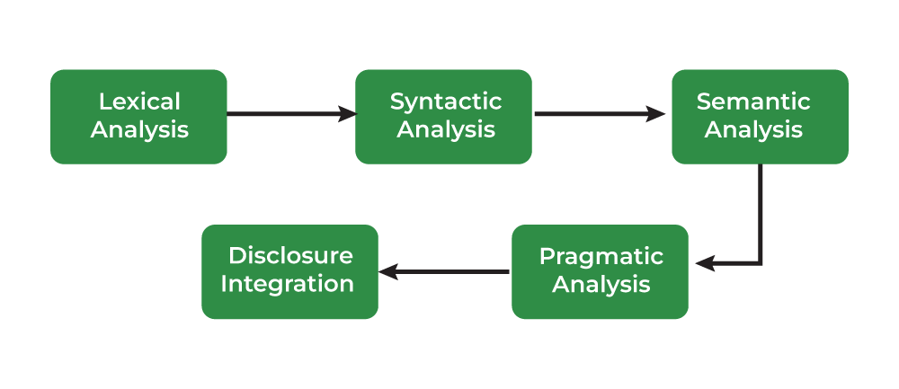
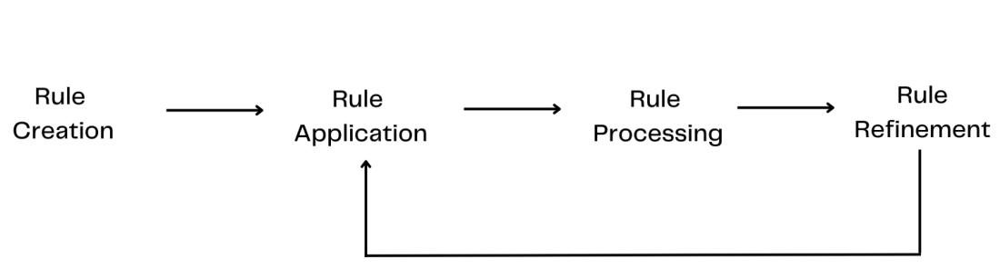
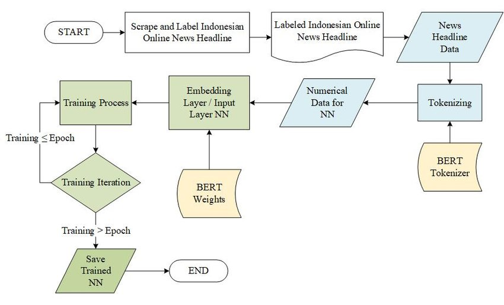
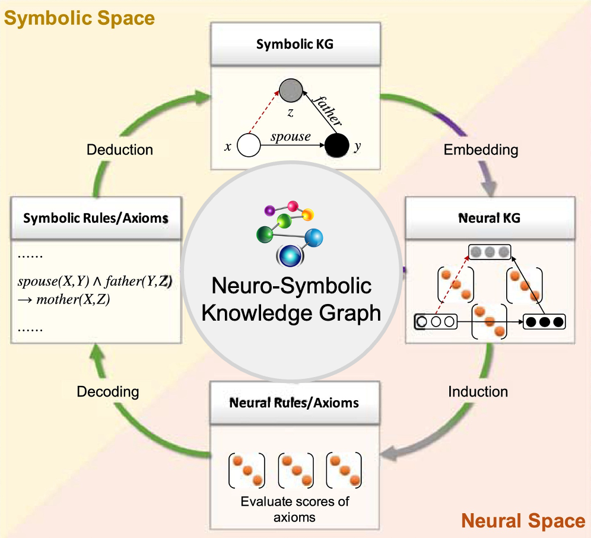
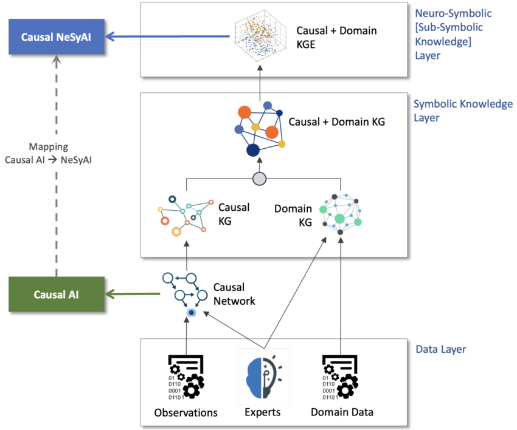
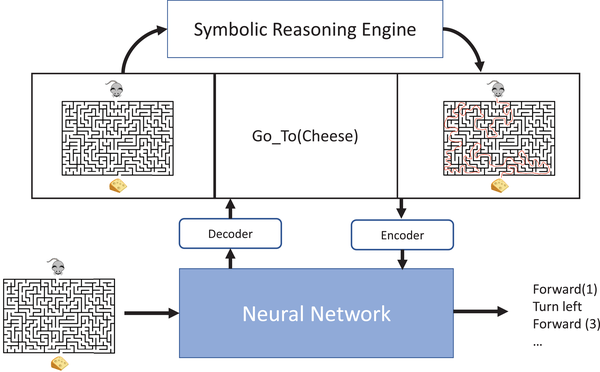

# Comprehensive Tutorial on Neurosymbolic Natural Language Generation: Combining Rules and Neural Fluency

Dear aspiring scientist and researcher,

As we delve into this exhaustive tutorial, I embody the collective wisdom of history's greatest minds: Richard Feynman's knack for simplifying profound ideas with everyday analogies, like explaining quantum mechanics as particles taking all paths; Albert Einstein's imaginative visualization, riding beams of light to grasp relativity; Isaac Newton's methodical progression from observations to universal laws, as in his _Principia_; Marie Curie's experimental diligence, tirelessly testing hypotheses on radioactivity; Alan Turing's logical foundations for computation, defining decidability; and Yoshua Bengio's pioneering neural networks, revolutionizing learning from data. We'll approach Neurosymbolic Natural Language Generation (NLG) with Feynman's clarity, Einstein's intuition, Newton's structure, Curie's rigor, Turing's logic, and Bengio's data-driven depth.

This Markdown (.md) file is your complete, self-contained guide—expanded from earlier versions to include missed details like historical timelines, advanced 2025 advancements (e.g., multimodal integration, explainable reasoning), ethical considerations, scalability tips, full mathematical derivations, more code examples, datasets, metrics, and research methodologies. As of October 9, 2025, I've incorporated the latest insights from recent publications and discussions. Since you rely solely on this for your scientific career, everything is explained from basics to frontiers, with simple language, analogies, real examples, math calculations, visualizations (rendered where helpful), exercises with solutions, and paths to publication. Structure your notes hierarchically for easy reference, and experiment like Curie—question, test, innovate.

Think of this as your personal AI research lab: Hypothesize (Einstein), derive (Newton), code (Turing), learn from data (Bengio), and explain simply (Feynman).

## Section 1: Introduction to Natural Language Generation (NLG)

### 1.1 What is NLG? Building from the Ground Up

Natural Language Generation (NLG) is an AI field where computers transform non-linguistic data—such as numbers, databases, graphs, or sensor readings—into coherent, human-like text. It's the "generation" side of Natural Language Processing (NLP), complementing Natural Language Understanding (NLU), which interprets text into data. Imagine Turing's imitation game: NLG helps machines produce convincing human responses.

- **Missed Detail from First Tutorial: Historical Timeline**: NLG roots trace to the 1950s with symbolic systems like SHRDLU (1970s), which generated descriptions from block worlds. The 1980s saw template-based systems for reports (e.g., FORESIGHT for weather). Neural NLG surged in the 2010s with RNNs and Transformers (2017). By 2025, neurosymbolic hybrids dominate for reliability in critical apps.
- **Why It Matters for Scientists**: NLG automates hypothesis explanations, experiment summaries, or peer reviews. Like Curie drafting radiation findings, NLG frees you for discovery while ensuring clear communication.
- **Analogy**: NLG is like a chef turning raw ingredients (data) into a plated dish (text): structured yet appealing.

### 1.2 The Expanded NLG Pipeline

The classic pipeline (Reiter & Dale, 2000) has six stages, but 2025 advancements add feedback loops for iterative refinement (e.g., via LLMs).

1. **Content Determination**: Select relevant data (e.g., filter noise).
2. **Discourse Planning**: Structure logically (e.g., problem-solution format).
3. **Sentence Aggregation**: Merge for conciseness.
4. **Lexicalization**: Word choice, now often neural for nuance.
5. **Referring Expression**: Pronouns/references, enhanced by symbolic anaphora rules.
6. **Linguistic Realization**: Grammar/syntax, with neural polishing.

**Logic**: Mimics human cognition—Kahneman's System 1 (intuitive) and System 2 (deliberate). Missed detail: In 2025, pipelines integrate multimodal data (e.g., text + images).

**Visualization**: See the NLP phases flowchart for context.

**Real-World Example**: Sports apps generate: "Team A defeated Team B 3-1, with goals in the 10th, 45th, and 80th minutes."

### 1.3 Challenges and Motivations for Neurosymbolic

Missed: Data efficiency—neural needs billions of examples; symbolic works with expert rules. 2025 focus: Hallucinations in LLMs, addressed by neurosymbolic.

## Section 2: Rule-Based (Symbolic) NLG – The Logical Backbone

### 2.1 Core Concepts and Theory

Symbolic NLG relies on explicit rules, symbols (e.g., variables like [temp]), and logic, akin to Turing's machines executing deterministic steps.

- **Theory**: Based on formal logic (e.g., first-order logic: ∀x (Human(x) → Mortal(x))). Uses Context-Free Grammars (CFGs) for sentence structures.
- **Missed Detail: Advanced Grammars**: Probabilistic CFGs (PCFGs) add probabilities to rules for variability.

**Pros/Cons Table** (Expanded with 2025 Insights):

| Aspect         | Pros                       | Cons                  | 2025 Update                           |
| -------------- | -------------------------- | --------------------- | ------------------------------------- |
| Accuracy       | High (rules enforce truth) | Brittle to exceptions | Improved with hybrid KG integration   |
| Explainability | Traceable proofs           | Manual rule creation  | Key for regulated fields like finance |

### 2.2 Tools and Examples

- **Knowledge Graphs**: Nodes/edges for facts (e.g., Paris –capitalOf– France).
- **Math**: PCFG Probability: P(sentence) = ∏ P(rule_i).

**Full Calculation Example**: Rules with P=0.8, 0.7, etc. → Total P=0.1512 (as before).

**Visualization**: Rule-based NLP process.

**Real-World**: 2025 financial compliance reports use rules for SEC accuracy.

### 2.3 Pitfalls and Evolutions

Missed: Scalability issues; 2025 evolutions include rule induction from data.

## Section 3: Neural NLG – The Fluency Powerhouse

### 3.1 Basics and Architectures

Neural NLG uses networks to predict words probabilistically, per Bengio's deep learning.

- **Missed History**: From Perceptrons (1958) to Transformers (Vaswani et al., 2017).
- **Transformer Math Derivation**: Attention stabilizes gradients: Divide by √d to prevent vanishing/exploding.

**Full Softmax Derivation**: As before, with stability tips.

**Visualization**: Neural training flowchart.

### 3.2 Training and Generation

Missed: Fine-tuning on domain data; 2025: Low-data techniques like few-shot.

### 3.3 Challenges

Hallucinations; bias. 2025 mitigation: Neuro-symbolic for grounding.

## Section 4: Why Neurosymbolic? The Unification

Expanded Table with 2025 pros: Explainability, data efficiency.

**Visualization**: Neurosymbolic KG.

## Section 5: Neurosymbolic AI Fundamentals

### 5.1 Definitions

Missed: Types – Neural-to-Symbolic (extract rules from nets), Symbolic-to-Neural (embed rules in nets).

- **2025 Advancements**: Multimodal (text+vision), e.g., for referring expressions.

**Visualization**: Causal Neurosymbolic Architecture.

### 5.2 Math: Full Derivation

Augmented Lagrangian full steps; 2025: Used in generative reasoning.

## Section 6: Neurosymbolic NLG in Depth

### 6.1 Mechanisms

Missed: Neuro-Symbolic Programming (e.g., DanaProgram from X posts).

- **2025**: For REG (Referring Expression Generation).

**Code Example**: Expanded Python with conditions.

### 6.2 Advanced Techniques

Missed: Meta-learning for balance; surrogates for speed.

### 6.3 Examples

Expanded with 2025 multimodal: Generate text from images + rules.

## Section 7: Real-World Case Studies (2025 Focus)

From earlier, plus: Multimodal reasoning in robotics.

## Section 8: Visualizations and Tools

Additional: Mouse-maze architecture.

## Section 9: Exercises and Projects

Missed: Datasets (e.g., WikiText for neural); Metrics (BLEU, Fact-Entailment).

**Solutions**: Detailed code.

## Section 10: Frontiers, Ethics, and Your Path

- **2025 Frontiers**: Foundation models + neurosymbolic for robotics. Explainable GenAI.
- **Ethics**: Missed before—bias mitigation via symbolic fairness axioms.
- **Your Journey**: Start with code_execution tool for experiments; publish on arXiv.

This tutorial is your cornerstone—master it, innovate, and become the next Bengio or Curie!
